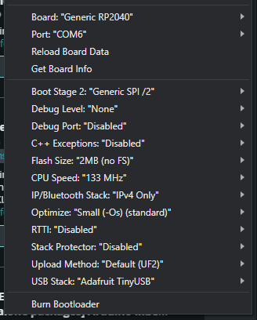

# RP2040 based RC-to-USB adapter

This project is an adapter allowing use of an RC transmitter as PC input device, i.e. to play racing games.\
It reads the 1-2ms PWM signal from 2-4ch RC receiver and presents it to the PC as joystick inputs.
The signal precision is ±0.0833μs (0-12000 range).

## How to install
Use one of the [precompiled binaries](https://github.com/aspyra/rp2040_vrc/tree/main/precompiled_binaries).\
While holding the boot select button on your board, plug it into your PC and simply drag the binary into the newly mounted *RPI-RP2* flash drive.

## How to set-up
Connect the adapter to your RC receiver and PC.\
Use a [gamepad testing website](https://duckduckgo.com/?q=gamepad+tester) and adjust your end-points and trim to use the full range of joystick axes.

## Hardware
It uses widely available RP2040 development boards like RaspberryPi Pico and Waveshare RP2040-Zero and a couple of servo/jumper wires.\
Note that the RP2040 inputs are not 5V tolerant, but all the RC receivers I tested had a 3.3V push-pull output.

Hardware example:\

\

\

\

## OPTIONAL: How to compile
Uses:\
https://github.com/earlephilhower/arduino-pico release 4.3.1\
https://github.com/adafruit/Adafruit_TinyUSB_Arduino release 4.3.1\
https://github.com/FastLED/FastLED release 3.9.8

Compiled in Arduino IDE 2.3.4\

