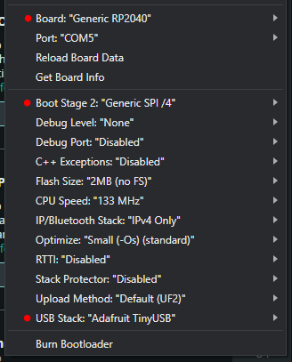

# RP2040 based RC-to-USB adapter

This project is an adapter allowing use of an RC transmitter as PC input device, i.e. to play racing games.\
It reads the 1-2ms PWM signal from 2-4ch RC receiver and presents it to the PC as joystick inputs.
The signal precision is ±0.0833μs (0-12000 range).

## Hardware
It uses widely available RP2040 development boards like RaspberryPi Pico and Waveshare RP2040-Zero and a couple of servo/jumper wires.\
Note that the RP2040 inputs are not 5V tolerant, but all the RC receivers I tested had a 3.3V push-pull output.

## How to install
Use one of the precompiled binaries.\
While holding the boot select button on your board, plug it into your PC and simply drag the binary into the newly mounted *RPI-RP2* flash drive.

## How to set-up
Connect the adapter to your RC receiver and PC.\
Use a [gamepad testing website](https://duckduckgo.com/?q=gamepad+tester) and adjust your end-points and trim to use the full range of joystick axes.

## OPTIONAL: How to compile
Uses:\
https://github.com/earlephilhower/arduino-pico release 4.3.1\
https://github.com/adafruit/Adafruit_TinyUSB_Arduino release 4.3.1

Compiled in Arduino IDE 2.3.4\

